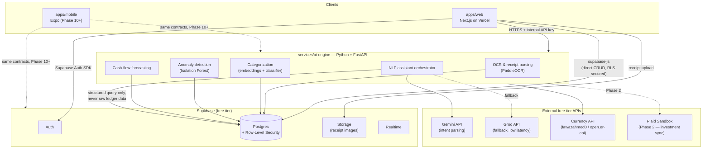
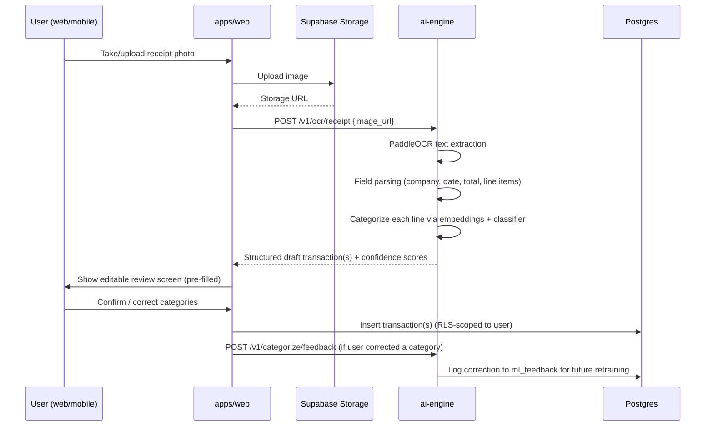
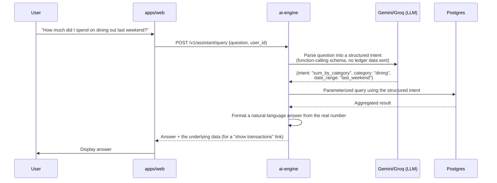

# Architecture

## 1. System overview

Fincue is split into three deployable units plus shared code, so
that a future mobile client can reuse everything except the web UI itself.



**Why a decoupled `ai-engine` instead of Next.js API routes doing
everything:** see `decisions.md` ADR-004. In short — language fit
(Python for ML), independent scaling of heavier ML workloads away from the
web app's request path, and a single AI implementation shared by web and
the future mobile app.

**Why Supabase for the "boring" backend (auth, CRUD, storage)
instead of a second custom service:** RLS lets the web (and later mobile)
client talk to Postgres directly and safely, which removes an entire class
of CRUD API code that would otherwise need writing, testing, and hosting.
See ADR-003.

## 2. Repository layout

```text
fincue/
├── .github/
│   └── workflows/            # CI/CD — documented in docs/deployment.md, not yet implemented
├── apps/
│   ├── web/                  # Next.js web client
│   └── mobile/                # Expo mobile client (Phase 10+)
├── services/
│   └── ai-engine/             # Decoupled Python/FastAPI backend for all AI/ML features
│       ├── app/                # FastAPI app (routers, services, schemas)
│       ├── models/             # Trained model artifacts (git-ignored)
│       ├── notebooks/          # Training/evaluation notebooks
│       └── datasets/           # Dataset-fetch scripts (raw data git-ignored)
├── packages/
│   ├── shared-types/           # TS types shared by web + mobile
│   ├── ui/                     # Shared UI primitives (web first, cross-platform tokens later)
│   └── config/                 # Shared ESLint/TS/Tailwind config
├── docs/                       # This documentation set
└── scripts/                    # One-off setup/maintenance scripts
```

<details>
<summary>Complete file tree, as generated (click to expand)</summary>

```text
.
├── .github
│   └── workflows
│       └── README.md
├── apps
│   ├── mobile
│   │   └── README.md
│   └── web
│       └── README.md
├── docs
│   ├── assets
│   │   └── README.md
│   ├── PRD.md
│   ├── api.md
│   ├── architecture.md
│   ├── database.md
│   ├── deployment.md
│   ├── developer-guide.md
│   ├── gamification-strategy.md
│   ├── glossary.md
│   ├── ml-strategy.md
│   ├── security.md
│   ├── testing-strategy.md
│   ├── troubleshooting.md
│   └── user-guide.md
├── packages
│   ├── config
│   │   └── README.md
│   ├── shared-types
│   │   └── README.md
│   └── ui
│       └── README.md
├── scripts
│   └── README.md
├── services
│   └── ai-engine
│       ├── app
│       │   └── README.md
│       ├── datasets
│       │   └── README.md
│       ├── models
│       │   └── README.md
│       ├── notebooks
│       │   └── README.md
│       └── README.md
├── .editorconfig
├── .env.example
├── .gitignore
├── .nvmrc
├── CHANGELOG.md
├── CODE_OF_CONDUCT.md
├── CONTRIBUTING.md
├── LICENSE
├── README.md
├── SECURITY.md
├── decisions.md            # git-ignored — present here, not in the actual tree, once you commit
├── memory.md               # git-ignored
├── package.json
├── pnpm-workspace.yaml
├── roadmap.md              # git-ignored
└── turbo.json

19 directories, 42 files
```

</details>

## 3. Environments

| Environment | Web | Database | ai-engine |
|---|---|---|---|
| **Local dev** | `next dev` on `localhost:3000` | Local Supabase CLI stack, or a dev Supabase project | `uvicorn` on `localhost:8000` |
| **Staging** (optional, Phase 2) | Vercel preview deployment (automatic per-PR) | A second free Supabase project | A second free Render service |
| **Production/demo** | Vercel production deployment | Primary Supabase project | Primary Render (or HF Spaces) deployment |

Given the free-tier project caps (2 Supabase projects, per
`docs/deployment.md`), most teams will use **one** Supabase project for
staging+production and rely on Vercel's automatic preview deployments (which
share the same database) for pre-merge review — acceptable for an FYP scale,
but document it as a known simplification in the final report.

## 4. Data flow walkthroughs

### 4.1 Receipt scan → categorized transaction



### 4.2 Natural-language assistant query



This pattern — **the LLM only ever sees the question text and returns
structured intent; it never receives account balances, transaction
amounts, or PII, and the final numeric answer always comes from a direct
database query, never from the LLM** — is a security and reliability
requirement, not just a nice-to-have. See `docs/security.md` and
`docs/ml-strategy.md`.

## 5. Offline-first ledger sync

The brief requires that transactions entered offline queue locally and
sync automatically. This is handled by **PowerSync** rather than a
hand-rolled sync layer — see `decisions.md` ADR-013 for the full
reasoning behind this choice.

1. **Local storage:** PowerSync's client SDK manages an embedded SQLite
   database on-device — via WA-SQLite/IndexedDB under the hood on web,
   native SQLite on mobile (Phase 10+) — so the app always reads and
   writes to a local database, online or offline. PowerSync owns this
   persistence layer directly; the team does not hand-write an IndexedDB
   wrapper.
2. **Sync rules:** a PowerSync "sync rules" configuration (YAML, hosted
   alongside the PowerSync Service) defines which rows of which Postgres
   tables replicate to which authenticated user. This works *alongside*,
   not instead of, the RLS policies in `docs/database.md` — RLS remains
   the authorization boundary for any direct Postgres access, sync rules
   scope what PowerSync replicates to a given device.
3. **Bidirectional sync:** PowerSync connects to Supabase's Postgres via
   logical replication (a one-time setup step on the Supabase project —
   see `docs/database.md`), streaming changes in both directions. Local
   writes queue automatically and sync when connectivity returns; remote
   changes stream down to the client without a custom polling loop.
   Retry, ordering, and conflict resolution are handled by PowerSync's
   sync protocol rather than bespoke application code — for this
   single-user-per-account ledger, true conflicts remain rare in
   practice (nobody else edits your transactions), but the mechanism
   handling that is now PowerSync's, not ours to maintain.
4. **One implementation, two platforms:** both `apps/web` and
   `apps/mobile` (Phase 10+) use PowerSync's respective client SDKs
   against the *same* sync rules and the *same* backend connection. This
   is the direct payoff of adopting PowerSync now instead of retrofitting
   sync when mobile development starts — there is no second sync
   implementation to write later.
5. **What this replaces:** an earlier version of this architecture used
   IndexedDB via Dexie.js on web and Expo SQLite on mobile, with a
   hand-rolled idempotent-upsert protocol keyed on a client-generated
   UUID. PowerSync replaces all of that — same problem, purpose-built
   tool, less custom sync code to write and debug across two platforms.

**A caveat inherited from this choice:** PowerSync's free tier
deactivates a project after 7 days without sync activity — the same
behavior Supabase's free tier has (see `docs/deployment.md`). Rather than
building a second keep-alive mechanism, the one already required for
Supabase is extended to cover PowerSync too.

## 7. Containerization

`services/ai-engine` is containerized with a single Dockerfile;
`apps/web` is not. This is a deliberate, narrow adoption rather than
containerizing the whole monorepo — see `decisions.md` ADR-018.

Why the ai-engine specifically: it carries the project's least
reproducible dependency surface (PaddleOCR pulls in system-level
libraries and OpenCV bindings that behave differently across operating
systems), and a container pins that environment identically for every
teammate and for whichever host ends up running it. It's also
forward-compatible with the still-open hosting decision in
`docs/deployment.md` — Google Cloud Run *requires* a container image, so
containerizing now means that door stays open regardless of when (or
whether) that decision is revisited, rather than needing to retrofit a
Dockerfile later under time pressure.

Why not the web app: Vercel's native build pipeline already builds and
deploys Next.js without a container, and wrapping it in one would add a
layer of complexity with no corresponding benefit — Vercel's platform
*is* the reproducible environment there.

One dependency worth knowing about regardless of this decision: the
Supabase CLI's local development stack (`supabase start`) already runs
Postgres, Auth, and Storage as Docker containers under the hood, so
Docker is a prerequisite for local development either way — this ADR
just makes that dependency deliberate and extends it to the ai-engine's
own deployment, rather than leaving it as an implicit, unexamined one.

## 8. Why not put everything behind Vercel serverless functions?

Considered and rejected as the *sole* backend (a hybrid is still used for
thin, fast operations): Vercel Hobby functions are capped at a short
execution duration and are billed/limited on a per-invocation and
GB-hours basis; heavier ML inference (OCR, embedding generation) is a poor
fit for that execution model and would risk exhausting the free
invocation quota faster than a dedicated always-Python service. Vercel
remains the right host for the **web app itself** — this is specifically
about where ML compute lives. See ADR-004 in `decisions.md`.

## 9. Scaling notes (explicitly out of scope, documented for honesty)

This architecture is sized for a demo/portfolio audience (dozens to low
hundreds of concurrent users), bounded by the free-tier limits documented
in `docs/deployment.md`. Notable ceilings to be upfront about in the FYP
report:

- Supabase free tier: 500 MB database, 1 GB file storage — receipt images
  in particular will hit this before transaction rows do; Cloudflare R2
  (10 GB free, zero egress fees) is the documented scale-up path.
- The `ai-engine`'s free hosting (Render/HF Spaces) cold-starts after
  inactivity — acceptable for a demo, not for a latency-sensitive
  production SLA.
- None of this blocks a real future deployment — it's a sequence of
  "upgrade this one thing" steps, not a rewrite, which is the entire
  point of choosing managed, standards-based services over bespoke
  infrastructure.
