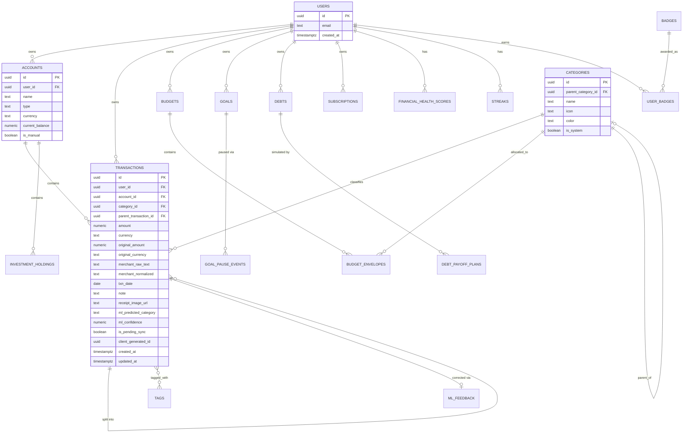

# Database Design

Target: PostgreSQL 15+ via Supabase. This document describes **schema and
structure only** — table shapes, relationships, indexes, and row-level
security policy *intent*. It intentionally does not include application
code (query builders, ORM models, business-logic functions); those belong
in `apps/web` and `services/ai-engine` once implemented.

## 1. Entity-relationship overview



*(Full schema continues below in tabular form — an ER diagram this size
becomes unreadable with every table included.)*

## 2. Table reference

Only non-obvious columns and constraints are annotated; assume every table
has `id uuid primary key default gen_random_uuid()` and `created_at
timestamptz default now()` unless noted.

### `accounts`
| Column | Type | Notes |
|---|---|---|
| `user_id` | `uuid` FK → `auth.users` | |
| `name` | `text` | e.g. "HBL Checking", "Cash Wallet" |
| `type` | `text` | `checking` \| `savings` \| `cash` \| `credit_card` \| `investment` |
| `currency` | `text` | ISO 4217 code, e.g. `USD`, `PKR` |
| `current_balance` | `numeric(14,2)` | Denormalized cache, recalculated from transactions |
| `is_manual` | `boolean` | `true` unless linked via Plaid (Phase 2) |

### `transactions`
The core table. Key design decisions:

- **Multi-currency:** `amount`/`currency` store the value in the
  *account's* currency; `original_amount`/`original_currency` are
  populated only when the user entered a value in a different currency,
  preserving what they actually typed for audit/undo purposes.
- **Splits:** a split receipt becomes one parent row (the original total,
  `is_split_parent = true`) plus N child rows referencing it via
  `parent_transaction_id`, each with its own category. Reporting queries
  should exclude parent rows that have children, to avoid double-counting.
- **Offline sync:** `client_generated_id` (a UUID generated on-device) is
  the idempotency key for sync — see `docs/architecture.md` §5. A unique
  constraint on `(user_id, client_generated_id)` makes retried syncs safe.
- **ML provenance:** `ml_predicted_category` + `ml_confidence` are kept
  even after a user assigns/corrects `category_id`, so accuracy can be
  measured against ground truth later (see `docs/ml-strategy.md`).

### `categories`
Self-referencing (`parent_category_id`) for two-level hierarchy (e.g.
"Food" → "Dining Out", "Groceries"). `is_system = true` for the seeded
default taxonomy; user-created categories have `is_system = false`.

### `tags` / `transaction_tags`
Standard many-to-many: `tags(id, user_id, name)` and
`transaction_tags(transaction_id, tag_id)` composite PK.

### `budgets` / `budget_envelopes`
`budgets(id, user_id, period_start, period_end)` — one row per budgeting
period (typically monthly). `budget_envelopes(id, budget_id, category_id,
allocated_amount, rollover_enabled, rolled_over_amount)` — one row per
category envelope within that period.

### `goals` / `goal_pause_events`
`goals(id, user_id, name, goal_type, target_amount, current_amount,
target_date, status)` — `goal_type` is `short_term` \| `retirement`.
`goal_pause_events(id, goal_id, paused_at, resumed_at, reason)` logs
"Milestone Pausing" suggestions and whether the user accepted them.

### `debts` / `debt_payoff_plans`
`debts(id, user_id, name, balance, interest_rate, minimum_payment)`.
`debt_payoff_plans(id, user_id, strategy, simulated_schedule jsonb,
generated_at)` — `strategy` is `avalanche` \| `snowball`;
`simulated_schedule` stores the computed month-by-month payoff plan as
JSON (a good fit for JSONB since it's write-once, read-whole, and doesn't
need to be queried column-by-column).

### `subscriptions`
`subscriptions(id, user_id, merchant, amount, currency, billing_cycle,
next_charge_date, price_history jsonb)` — `price_history` is an
append-only JSON array of `{date, amount}`, the input to price-creep
detection (see `docs/ml-strategy.md`).

### `investment_holdings` (Phase 2)
`investment_holdings(id, user_id, account_id, symbol, quantity,
cost_basis, current_value, synced_via)` — `synced_via` is `manual` \|
`plaid`.

### `net_worth_snapshots`
`net_worth_snapshots(id, user_id, snapshot_date, total_assets,
total_liabilities, net_worth)` — one row per day/week, computed by a
scheduled job (see `docs/deployment.md`), powering the net-worth-over-time
chart without recomputing history on every page load.

### Gamification tables
- `streaks(id, user_id, streak_type, current_count, longest_count,
  last_incremented_date)`
- `financial_health_scores(id, user_id, score_date, score,
  components jsonb)` — `components` breaks the 0–100 score into its
  weighted parts (see `docs/gamification-strategy.md`) for transparency
  in the UI ("why is my score 72?").
- `badges(id, code, name, description, criteria jsonb)` and
  `user_badges(user_id, badge_id, earned_at)`.

### `exchange_rates_cache`
`exchange_rates_cache(base_currency, target_currency, rate, source, fetched_at)`
— composite PK `(base_currency, target_currency, fetched_at::date)`.
Caching daily rates locally avoids re-fetching the free currency API on
every page load and gives the app a fallback if that API is briefly
unreachable.

### `ml_feedback`
`ml_feedback(id, transaction_id, predicted_category_id,
corrected_category_id, created_at)` — every time a user overrides the
ML-predicted category, a row lands here. This is the training signal for
periodic model retraining (see `docs/ml-strategy.md`).

### `audit_log`
`audit_log(id, user_id, actor, action, entity_type, entity_id, diff jsonb,
created_at)` — append-only. Populated by a Postgres trigger (implementation
left to `services/ai-engine` or a Supabase Edge Function; the *schema*
here just reserves the table) for security-sensitive tables
(`accounts`, `transactions`, `debts`).

## 3. Indexing strategy

Illustrative, not exhaustive — the exact index list should be tuned against
real query patterns once `docs/api.md`'s endpoints are implemented and
profiled. Starting set:

```sql
-- The single most common query: "this user's transactions in date order"
CREATE INDEX idx_transactions_user_date
    ON transactions (user_id, txn_date DESC);

-- Filtering by account (e.g., a single-account register view)
CREATE INDEX idx_transactions_account
    ON transactions (account_id, txn_date DESC);

-- Category-based reporting (Sankey diagram, budget-vs-actual)
CREATE INDEX idx_transactions_category
    ON transactions (category_id);

-- Merchant search / "did I already log this receipt" duplicate checks
CREATE INDEX idx_transactions_merchant_trgm
    ON transactions USING gin (merchant_normalized gin_trgm_ops);

-- Idempotent offline sync upserts
CREATE UNIQUE INDEX idx_transactions_client_generated_id
    ON transactions (user_id, client_generated_id);

-- Subscription price-creep job scans "what's due soon"
CREATE INDEX idx_subscriptions_next_charge
    ON subscriptions (user_id, next_charge_date);
```

`idx_transactions_merchant_trgm` requires the `pg_trgm` extension
(`CREATE EXTENSION IF NOT EXISTS pg_trgm;`), which Supabase supports out of
the box — useful for fuzzy merchant-name search and for de-duplicating
near-identical merchant strings before they hit the categorizer.

## 4. Row-Level Security (RLS) strategy

Every user-owned table has RLS **enabled** with a policy shaped like:

```sql
ALTER TABLE transactions ENABLE ROW LEVEL SECURITY;

CREATE POLICY "Users can only access their own transactions"
    ON transactions
    FOR ALL
    USING (auth.uid() = user_id)
    WITH CHECK (auth.uid() = user_id);
```

This is the primary authorization mechanism for the web/mobile clients
talking to Postgres directly (see `docs/architecture.md`) — it means a bug
in frontend code cannot leak one user's data to another, because the
database itself refuses the query. The `services/ai-engine` backend
connects with the Postgres **service role** (which bypasses RLS) since it
needs to run scheduled jobs across all users (e.g., anomaly scans); it must
therefore do its own `user_id` scoping in application code, and this
distinction should be called out explicitly in any security review — see
`docs/security.md`.

## 5. Migrations

Use the Supabase CLI's migration workflow (`supabase migration new
<name>`, plain SQL files under `supabase/migrations/`) rather than an ORM's
auto-migration feature — for a project this size, plain reviewable SQL is
easier to reason about in pull requests and in the FYP report's appendix
than generated migration DSLs. Each migration file should be small and
named descriptively (e.g. `0007_add_subscription_price_history.sql`), and
`docs/database.md` (this file) should be updated in the same PR as any
schema-changing migration — see `CONTRIBUTING.md`.

## 6. PowerSync requirements and the keep-alive heartbeat table

Two small additions to this schema exist purely to support infrastructure
decisions documented elsewhere, not the product itself:

- **Logical replication:** PowerSync (see `docs/architecture.md` §5)
  requires Postgres's logical replication to be enabled on the Supabase
  project, plus a replication slot and publication that PowerSync's setup
  wizard creates. This is a project-level configuration step, not a
  schema change, but it's worth a Supabase-project checklist entry rather
  than being discovered as a surprise.
- **Heartbeat table:** the write-based keep-alive workflow
  (`docs/deployment.md` §4) needs something to write to. A minimal
  utility table, not a domain entity, and deliberately excluded from the
  ER diagram in §1 for that reason:

```sql
CREATE TABLE _keepalive_heartbeat (
    id          smallint PRIMARY KEY DEFAULT 1 CHECK (id = 1),
    pinged_at   timestamptz NOT NULL DEFAULT now()
);
```

The `CHECK (id = 1)` constraint keeps this a genuine single-row table —
the workflow always upserts the same row, so there's never a reason for a
second one. No RLS policy is needed here; this table holds no
user-scoped data and is written only by the service role from the
GitHub Actions workflow.
