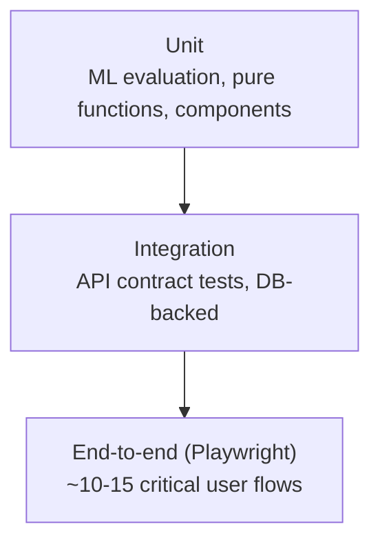

# Testing Strategy

## 1. The testing pyramid, applied to this stack

Most tests should be fast and narrow (unit); a small number should verify
the whole system actually works together (e2e). This is a standard
recommendation for a reason: e2e tests are valuable but slow and flaky
relative to unit tests, so over-investing in them slows the team down
without proportionally increasing confidence.

## 2. Tools

| Layer | Tool | Notes |
|---|---|---|
| Web unit/component | [Vitest](https://vitest.dev/) + [React Testing Library](https://testing-library.com/) | Fast, works well with Next.js/Vite tooling. |
| Web e2e | [Playwright](https://playwright.dev/) | Cross-browser, good CI support, free. |
| ai-engine unit/integration | [pytest](https://docs.pytest.org/) | Standard for FastAPI projects. |
| ai-engine ML evaluation | pytest + a fixed held-out dataset split | Treat model accuracy as a regression-testable metric, not just a notebook printout — see §4. |
| API contract | pytest (ai-engine) hitting a local FastAPI `TestClient`, plus a Postman/Bruno collection mirroring `docs/api.md` for manual/exploratory testing | |

## 3. What to test first (priority order)

1. **RLS policies** — a negative test that logs in as User A and asserts
   User B's transactions are unreachable, for every user-owned table in
   `docs/database.md`. This is the single highest-value security test in
   the whole project; treat a failure here as a blocking bug regardless of
   what else is in flight.
2. **Transaction CRUD + offline sync idempotency** — inserting the same
   `client_generated_id` twice (simulating a retried sync) should not
   create a duplicate row (see `docs/architecture.md` §5).
3. **Money math** — currency conversion, split-transaction sums, envelope
   rollover calculations. Use fixed-point/decimal types in tests, not
   floats, and assert exact values — off-by-a-cent bugs in a finance app
   are exactly the kind of thing that looks fine in a demo and embarrasses
   you in a follow-up question.
4. **Categorization model evaluation** — see §4.
5. **NLP assistant intent parsing** — a fixed set of example questions per
   supported intent (see `docs/ml-strategy.md`), asserting the LLM's
   output maps to the correct structured intent. This is inherently a bit
   flaky (LLM outputs vary) — assert on the *parsed intent structure*, not
   exact wording, and consider a small retry-on-malformed-output policy in
   the implementation itself, not just the test.
6. **Auth flows and session timeout.**
7. **E2E happy paths:** sign up → add account → log a transaction → see it
   reflected in Safe-to-Spend and the Sankey diagram; scan a receipt →
   review → save; create a budget → overspend an envelope → see the color
   nudge change.

## 4. Evaluating the ML models like a scientist, not a demo

For the categorization model specifically (the most "real ML" component,
and the one most worth documenting rigorously for the FYP evaluation):

- Fix a **held-out test split** of the training dataset (see
  `docs/ml-strategy.md`) that the model never trains on, and re-evaluate
  against the exact same split every time the model is retrained, so
  accuracy changes are actually comparable over time.
- Report **precision, recall, and F1 per category**, plus a confusion
  matrix — not just a single overall accuracy number, which can hide poor
  performance on rare categories.
- Track these numbers over successive model versions in a simple table in
  `services/ai-engine/notebooks/` or an appendix of the FYP report — "our
  model went from 78% to 85% F1 after incorporating user corrections" is a
  much stronger result to present than a single static number.
- Do the same discipline for the OCR key-field extraction against SROIE
  (exact-match accuracy per field: company/date/total).

## 5. Test data hygiene

- **Never use real personal financial data in tests or fixtures** — even
  your own. Use synthetic data generated for this purpose (see
  `scripts/seed-demo-data.ts` in `scripts/README.md`).
- Kaggle datasets used for ML training (see `docs/ml-strategy.md`) are
  fine for training/evaluation notebooks but should not be committed as
  test fixtures in the application repo — reference them by download
  script, not by checked-in CSV.
- Any screenshots or recordings used in the FYP report or README should
  use synthetic/demo accounts, never a real bank account or real personal
  spending history, even if that's more convenient to produce.

## 6. Coverage targets

Treat coverage percentage as a signal, not a goal to game:

- **Core money-math and RLS-adjacent logic:** aim high (70%+ line
  coverage is a reasonable bar, but a thoughtful set of edge-case tests
  matters more than the number).
- **UI components:** cover behavior (does clicking this do the right
  thing?), not implementation details (don't assert on internal state
  shape) — brittle tests that break on harmless refactors are worse than
  no test.
- **Notebooks:** not unit-tested in the traditional sense; their "test" is
  the evaluation metrics in §4, re-run and compared over time.

## 7. CI integration

See `docs/deployment.md` §5 — `pnpm test` (web) and `pytest` (ai-engine)
both run in the CI workflow on every pull request; a failing test blocks
merge to `main`.
