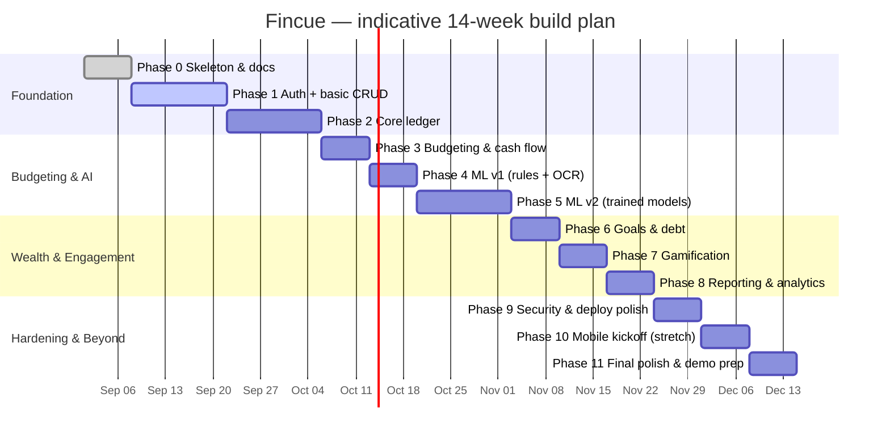

# Roadmap

Granular, phase-by-phase implementation plan. Assumes a team of 2–4
students over a 12–16 week FYP timeline (**confirm/adjust this assumption
for your actual team — see `memory.md`, "Open questions"**). Each phase
lists concrete tasks (not vague milestones) and explicit exit criteria, so
"done" is never a judgment call made in the moment.

## Timeline overview

Phases 3–8 can reorder somewhat based on team interest/strengths, but
**Phase 1 and 2 must come first** (nothing else works without a ledger),
and **Phase 9 (security hardening) must happen before any public
demo/deploy with real-ish data**, not be left until the very end.

---

## Phase 0 — Repository skeleton & documentation ✅ (this deliverable)

**Goal:** an exhaustively researched, defensible plan before any feature
code exists.

- [x] Research free-tier hosting, databases, ML/LLM providers, datasets.
- [x] Design the monorepo structure.
- [x] Design the database schema, API contract, and security model.
- [x] Write the full documentation set.
- [x] Scope every feature into MVP / Phase 2 / Stretch.

**Exit criteria:** this repository, as delivered.

---

## Phase 1 — Foundation: auth, schema, bare UI shell

**Goal:** a deployed, authenticated, empty app — the "hello world" that
proves every piece of the free-tier stack actually connects to every
other piece before any real feature is built on top.

1. Create the Supabase project; apply `docs/database.md`'s schema as real
   migration files under `supabase/migrations/`; enable RLS on every
   user-owned table and write the negative test from
   `docs/testing-strategy.md` §3.1 before moving on.
2. Scaffold `apps/web` (Next.js), wire up the Supabase client, implement
   sign-up/login/logout using Supabase Auth.
3. Scaffold `services/ai-engine` (FastAPI), write its Dockerfile (see
   `docs/architecture.md` §7), implement `GET /v1/health` only — no ML
   yet — and deploy it to Render. (The Render-vs-Cloud-Run hosting
   question is intentionally still open — see `decisions.md` ADR-014 —
   but Render is the default to unblock this phase; the Dockerfile keeps
   Cloud Run available later without rework.)
4. Deploy `apps/web` to Vercel; confirm it can reach both Supabase and the
   deployed `ai-engine` health endpoint.
5. Set up the scheduled GitHub Actions keep-alive workflow
   (`docs/deployment.md` §4) so the Supabase project doesn't pause during
   Phase 2+ development. Make sure the ping performs an actual write
   (upsert a heartbeat row), not just a read — see `decisions.md`
   ADR-017. This workflow gets a second target added in Phase 2 once
   PowerSync exists.
6. Populate `packages/shared-types` with the core entity types
   (Transaction, Account, Category, Budget) matching the schema.

**Exit criteria:** a real person can sign up, log in, and see an empty
dashboard, on the actual deployed URLs (not just `localhost`).

---

## Phase 2 — Core transaction & ledger management

**Goal:** everything in PRD §4.1.

1. Manual transaction entry (amount, category, date, note, account).
2. Integrate PowerSync: enable Postgres logical replication on the
   Supabase project, define sync rules scoping each table to
   `auth.uid()`, and wire the PowerSync Web SDK into `apps/web` — see
   `docs/architecture.md` §5. Extend the Phase 1 keep-alive workflow to
   also ping PowerSync (same 7-day inactivity risk — see
   `docs/deployment.md`). Write the idempotency/offline test from
   `docs/testing-strategy.md` §3.2 against PowerSync's sync behavior
   rather than a hand-rolled queue.
3. Multi-currency: live-rate fetch from `@fawazahmed0/currency-api` +
   manual-rate override + `exchange_rates_cache` table.
4. Receipt upload to Supabase Storage (OCR wiring comes in Phase 4 — for
   now, just store the image and let the user manually fill in the
   fields).
5. Transaction splitting (parent/child rows per `docs/database.md`).
6. Free-text tags + tag-based filtering.

**Exit criteria:** a user can fully manage their ledger by hand, offline
or online, in one or more currencies, with no ML involved yet.

---

## Phase 3 — Budgeting & cash flow control

**Goal:** everything in PRD §4.3 tagged MVP.

1. Zero-based budget creation UI (envelope-per-category).
2. Rollover logic (unspent envelope funds carry to next period, if
   enabled).
3. Safe-to-Spend calculation (balance minus upcoming known bills —
   requires the subscriptions list from step 4 below to be meaningful).
4. Subscription manager (recurring merchant detection can start manual —
   "mark this transaction as recurring" — with automatic detection as a
   Phase 5 ML enhancement).
5. Burn-rate visualizer (simple chart, not yet the full Sankey — that's
   Phase 8).

**Exit criteria:** a user can build a monthly budget, see it enforced with
rollovers, and get an accurate Safe-to-Spend number.

---

## Phase 4 — ML v1: rule-based categorization + OCR MVP

**Goal:** ship the _simplest credible version_ of the two most
visible AI features before attempting the harder trained-model versions.

1. Rule-based/keyword categorization (the fallback layer from
   `docs/ml-strategy.md` §1) wired into transaction entry — this alone
   already demonstrates "smart categorization" for common merchants.
2. PaddleOCR integrated into `ai-engine`'s `/v1/ocr/receipt` endpoint,
   with the regex/heuristic field-extraction layer from
   `docs/ml-strategy.md` §2.
3. Wire the review-before-save UI flow from `docs/architecture.md` §4.1 —
   never auto-save an OCR result without user confirmation.
4. Evaluate the OCR heuristic layer against the SROIE dataset and record
   real accuracy numbers (not just "looked right on my receipts").

**Exit criteria:** receipt scanning and categorization both work
end-to-end, with a documented (if modest) accuracy baseline to improve on
in Phase 5.

---

## Phase 5 — ML v2: trained categorization model, anomaly detection, NLP assistant

**Goal:** the "real ML" phase — this is where the FYP's AI claims get
their strongest evidence.

1. Fetch the Kaggle categorization datasets (`docs/ml-strategy.md` §1),
   train the embeddings + classifier pipeline in
   `services/ai-engine/notebooks/02_train_categorizer.ipynb`, evaluate
   with precision/recall/F1 + confusion matrix
   (`docs/testing-strategy.md` §4), export the model artifact.
2. Wire the trained model into `/v1/categorize`, with the rule-based
   layer (Phase 4) now demoted to a fallback for low-confidence/unseen
   merchants, not the primary path.
3. Implement `ml_feedback` capture (`docs/database.md`) whenever a user
   corrects a category — this is the active-learning loop, needed even if
   the first retraining doesn't happen until later.
4. Implement anomaly detection (`docs/ml-strategy.md` §3): duplicate-charge
   rule, per-merchant statistical outlier check, subscription price-creep
   rule — wire into `/v1/anomalies/scan` and a scheduled job.
5. Implement the NLP assistant (`docs/ml-strategy.md` §5,
   `docs/architecture.md` §4.2): the fixed intent schema, the Gemini/Groq
   client wrapper, and the parameterized-query execution layer. Test
   against the fixed example-question set from
   `docs/testing-strategy.md` §3.5.
6. Implement predictive overspending alerts and the cash-flow forecaster
   (`docs/ml-strategy.md` §4) using the simple statistical baseline.

**Exit criteria:** all four AI/ML features (categorization, OCR, anomaly
detection, NLP assistant) work end-to-end with documented accuracy/
evaluation numbers — this phase is the centerpiece of the FYP report's
technical contribution.

---

## Phase 6 — Goals & wealth building

**Goal:** PRD §4.4.

1. Short-term goal CRUD + progress tracking.
2. Retirement projection calculator (compound interest + inflation
   formula — deterministic, not simulation-based, per PRD scoping).
3. Round-up savings (computed at transaction-save time into a virtual
   envelope/goal).
4. Avalanche vs. Snowball debt payoff simulator (side-by-side comparison
   UI, backed by the `debt_payoff_plans` table).
5. Net worth tracking (manual account balances → `net_worth_snapshots`
   via a scheduled job).
6. **If time allows (Phase 2, see `docs/PRD.md` §4.4 and ADR-023):**
   market data ingestion (`docs/ml-strategy.md` §6, `docs/database.md`
   §7) — schedule the Alpha Vantage fetch job first, against a handful of
   test symbols, before building anything that depends on it. Then, in
   order: automatic portfolio revaluation, the risk-profile
   questionnaire, concentration/volatility flags, and only once all of
   that is solid and tested (`docs/testing-strategy.md` §8), the
   AI-generated portfolio insight summaries — with the server-side
   directive-language check (`docs/testing-strategy.md` §9) built
   _before_ the first insight ever reaches a user, not retrofitted after.
7. **If time allows:** Milestone Pausing suggestion logic (Phase 2 item —
   don't start this before everything above is solid).

**Exit criteria:** a user can set and track goals, compare debt strategies,
and see net worth over time. If Phase 2 items in step 6 are reached: a
user can see their portfolio automatically revalued with a visible
timestamp/source, and any AI commentary on it is explanatory only,
verified by an automated test that would fail on a directive statement.

---

## Phase 7 — Gamification & behavioral finance

**Goal:** PRD §4.5, per the design in `docs/gamification-strategy.md`.

1. Financial Health Score computation (scheduled job) + the
   component-breakdown UI.
2. Spending streak tracking + display.
3. Color-coded envelope progress bars (green/yellow/red thresholds).
4. Starter badge set (6 badges per `docs/gamification-strategy.md` §4) +
   unlock animation.

**Exit criteria:** the app visibly rewards good habits, not just tracks
data — this is often the most demo-friendly phase, sequence it before a
mid-project supervisor check-in if possible.

---

## Phase 8 — Reporting & visual analytics

**Goal:** PRD §4.6.

1. Sankey diagram (income → categories) using D3-sankey or
   `@nivo/sankey`.
2. A well-designed **default** dashboard (drag-and-drop customization is
   Phase 2 — don't build the customization framework before the fixed
   version is good).
3. Tax-deductible transaction export (CSV, filtered by a
   tax-relevant tag/category).
4. **If time allows:** "Financial Wrapped" summary (Phase 2 item).

**Exit criteria:** the reporting views are the most visually polished part
of the demo — budget extra design time here, it's high-visibility.

---

## Phase 9 — Security hardening & deployment polish

**Goal:** do not skip this in favor of more features — it protects the
credibility of everything built so far.

1. Full pass through `docs/security.md`'s checklist: RLS verified on
   every table, secrets audit (`git log -p` review, no leaked keys),
   session auto-timeout implemented, biometric/WebAuthn re-auth
   implemented.
2. Data export (`docs/security.md` §8) and account deletion implemented.
3. Dependency audit (`pnpm audit`, `pip-audit`) — fix or document any
   high/critical findings.
4. CI pipeline (`docs/deployment.md` §5) actually implemented in
   `.github/workflows/`, not just documented.
5. Error monitoring (Sentry) wired into both `apps/web` and
   `services/ai-engine`.
6. Re-verify every free-tier limit in `docs/deployment.md` is still
   accurate — re-check the official pricing pages, don't trust the dates
   in this repo blindly by this point in the project.

**Exit criteria:** you would be comfortable with a security-minded
reviewer looking closely at this project — because for the demo, someone
might.

---

## Phase 10 — Mobile app kickoff (stretch goal)

**Goal:** PRD's "secondary mobile app" — only start this if Phases 1–9 are
genuinely solid; a half-finished mobile app is a worse demo outcome than a
polished web app plus an honest "architected for mobile, see
`docs/architecture.md`" statement.

1. Scaffold `apps/mobile` (Expo), consuming `packages/shared-types` and
   the same Supabase project + `ai-engine` API as `apps/web`.
2. Implement the highest-value subset first: view transactions, add a
   transaction, view Safe-to-Spend — not full feature parity.
3. `expo-local-authentication` for biometric lock.
4. Firebase Cloud Messaging for push notifications (budget alerts,
   subscription price-creep warnings).

**Exit criteria:** a working, narrow mobile demo that proves the
decoupled-backend architecture claim from `docs/architecture.md` — it does
not need feature parity with web to be a legitimate result.

---

## Phase 11 — Final polish & demo prep

1. Seed a convincing synthetic demo dataset (`scripts/seed-demo-data.ts`)
   — several months of realistic transaction history, at least one
   correctly-detected anomaly, at least one goal near completion, so the
   demo has something to show in every feature area.
2. Write/finalize the FYP report sections that map directly to this
   repo's docs: architecture (`docs/architecture.md`), ML evaluation
   (`docs/testing-strategy.md` §4 results), and security
   (`docs/security.md`).
3. Rehearse the demo against the real deployed URLs, including a
   deliberate cold-start warm-up (`docs/troubleshooting.md`) a few minutes
   before presenting.
4. Tag a `v1.0.0` release and update `CHANGELOG.md`.

**Exit criteria:** you could hand this repository to a stranger and, using
only `README.md` and `docs/`, they could understand what it does, how it's
built, and why every major decision was made the way it was.
